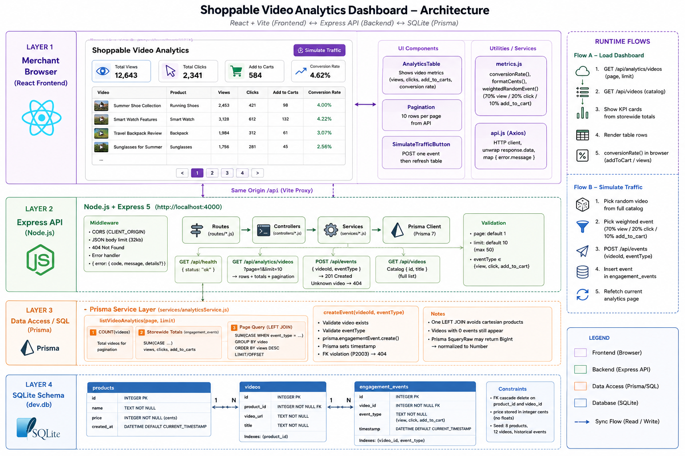

# Shoppable Video Analytics Dashboard

**Videoselz Take-Home Project — August 2026**  
Full Stack Developer technical evaluation.

A simplified dashboard that e-commerce merchants use to track the performance of shoppable videos on their storefronts. Merchants can see views, clicks, add-to-cart conversions, and conversion rate (`add to carts / views`, calculated on the frontend). A **Simulate Traffic** button posts a random engagement event to the API (webhook-style) and refreshes the table.

This repository: [hirakmahata/Videoselz-Assignment](https://github.com/hirakmahata/Videoselz-Assignment)

---

## Submission materials

| Item | Link |
| --- | --- |
| **This project** | [github.com/hirakmahata/Videoselz-Assignment](https://github.com/hirakmahata/Videoselz-Assignment) |
| **30-second candidate pitch** (YouTube unlisted) | [YouTube Link](https://youtube.com/shorts/Hyfy6KNpPcw?feature=shared) |
| **Technical walkthrough** (3–5 min Loom or screen recording) | [Loom Recording](https://www.loom.com/share/62c974c36645432b8b1a914516e9a9ba) |
| **AI prompting log** | [`AI_PROMPTING.md`](./AI_PROMPTING.md) |

### Other public repositories

Significant personal / open-source work on GitHub ([profile](https://github.com/hirakmahata)):

| Repository | What it is |
| --- | --- |
| [mern-ecommerce-frontend](https://github.com/hirakmahata/mern-ecommerce-frontend) / [mern-ecommerce-backend](https://github.com/hirakmahata/mern-ecommerce-backend) | Full-stack MERN e-commerce store |
| [xflix-frontend](https://github.com/hirakmahata/xflix-frontend) | Video streaming frontend |
| [comment-system](https://github.com/hirakmahata/comment-system) | Nested comment UI |
| [dynamic-comment-widget](https://github.com/hirakmahata/dynamic-comment-widget) | Embeddable comment widget |
| [medify](https://github.com/hirakmahata/medify) | Medical appointment / hospital finder UI |
| [botAI](https://github.com/hirakmahata/botAI) | Conversational AI chat UI |
| [expense_tracker](https://github.com/hirakmahata/expense_tracker) | Personal expense tracker |
| [Admin-UI](https://github.com/hirakmahata/Admin-UI) | Admin dashboard with search, filter, and bulk actions |
| [movies_backend](https://github.com/hirakmahata/movies_backend) | Movies REST API |
| [count_down_timer](https://github.com/hirakmahata/count_down_timer) | Countdown timer |
| [ipl](https://github.com/hirakmahata/ipl) / [heroku-ipl-app](https://github.com/hirakmahata/heroku-ipl-app) | IPL cricket data visualization |

---

## Assignment requirements

| Requirement | How it is met |
| --- | --- |
| Normalized SQL: **Products**, **Videos**, **EngagementEvents** | SQLite via Prisma (`products` → `videos` → `engagement_events`) |
| `POST /api/events` | Ingests one engagement event (`view`, `click`, `add_to_cart`) |
| `GET /api/analytics/videos` | Aggregated views, clicks, add-to-carts; `page` / `limit` pagination |
| Data table | Videos with Views, Clicks, Conversions |
| Conversion rate column | `addToCart / views` computed in the browser (`frontend/src/services/metrics.js`) |
| Simulate Traffic button | Posts a random payload to `POST /api/events`, then refetches the table |
| React frontend + Node.js/Express + SQLite | See [Tech stack](#tech-stack) |
| No Tailwind | Semantic HTML + CSS Modules |

---

## Tech stack

| Layer | Tools |
| --- | --- |
| **Frontend** | React 19, Vite 8, Axios, CSS Modules (**no Tailwind**) |
| **Backend** | Node.js (ESM), Express 5, CORS, dotenv |
| **Database** | SQLite via Prisma 7 and the `better-sqlite3` adapter |

There is no root `package.json`. `frontend/` and `backend/` are independent npm packages.

---

## Project structure

```
Videoselz-Assignment/
├── AI_PROMPTING.md                   Log of AI prompts used on this assignment
├── README.md
├── frontend/                         React dashboard (Vite on :5173)
│   ├── index.html
│   ├── vite.config.js                Proxies /api → http://localhost:4000
│   └── src/
│       ├── App.jsx                   Root shell
│       ├── pages/                    Dashboard page + CSS Module
│       ├── components/
│       │   ├── AnalyticsTable/       Paginated metrics table
│       │   ├── Pagination/
│       │   └── SimulateTrafficButton/
│       └── services/
│           ├── api.js                Axios client for /api
│           └── metrics.js            Conversion rate, formatting, random events
│
└── backend/                          Express API (HTTP on :4000)
    ├── prisma.config.ts              Prisma 7 config (DATABASE_URL)
    ├── prisma/
    │   ├── schema.prisma             Products, Videos, EngagementEvents
    │   ├── seed.js                   Demo products, videos, events
    │   └── migrations/
    └── src/
        ├── server.js                 Process entry (listen)
        ├── app.js                    Middleware + route mount
        ├── db.js                     Shared Prisma client
        ├── routes/                   Thin routers
        ├── controllers/              HTTP status and JSON only
        ├── services/                 Validation, Prisma, analytics SQL
        └── middleware/               404 and error handler
```

Request flow on the API: **routes → controllers → services → Prisma**.

---

## Prerequisites

- **Node.js 20+** (Prisma 7 and Express 5)
- npm (ships with Node)

---

## Getting started

Clone the repo, then set up each package in its own terminal.

```bash
git clone https://github.com/hirakmahata/Videoselz-Assignment.git
cd Videoselz-Assignment
```

### 1. Backend — install, migrate, seed, start

```bash
cd backend
cp .env.example .env
npm install
npm run seed
npm run dev
```

`npm run seed` does three things in order:

1. `prisma generate` — generates the Prisma client
2. `prisma migrate deploy` — applies the checked-in migration (creates `backend/prisma/dev.db`)
3. `node prisma/seed.js` — inserts demo products, videos, and historical engagement events

The API listens on [http://localhost:4000](http://localhost:4000). Health check: [http://localhost:4000/api/health](http://localhost:4000/api/health).

To wipe and re-seed: `npm run reset-db`.

### 2. Frontend — install and start

In a second terminal:

```bash
cd frontend
npm install
npm run dev
```

Open [http://localhost:5173](http://localhost:5173). Vite proxies `/api` to Express on port `4000`, so the dashboard and API share one origin in the browser.

### Environment variables

Copy `backend/.env.example` to `backend/.env`. Defaults:

| Variable | Default | Purpose |
| --- | --- | --- |
| `DATABASE_URL` | `file:./prisma/dev.db` | SQLite path (relative to `backend/`) |
| `PORT` | `4000` | API listen port |
| `CLIENT_ORIGIN` | `http://localhost:5173` | CORS origin |

### Scripts

**Backend** (`cd backend`):

| Script | What it does |
| --- | --- |
| `npm run seed` | `prisma generate` + `migrate deploy` + seed. Safe to re-run; no-ops if products already exist. |
| `npm run reset-db` | Same as seed, but clears tables first (`--reset`). |
| `npm run dev` | API with `node --watch` on port `4000`. |
| `npm start` | API without watch. |
| `npm run prisma:generate` | Regenerate the Prisma client. |
| `npm run prisma:migrate` | Create a new Prisma migration (`prisma migrate dev`). |

**Frontend** (`cd frontend`):

| Script | What it does |
| --- | --- |
| `npm run dev` | Vite dev server on port `5173`. |
| `npm run build` | Production bundle. |
| `npm run preview` | Serve the production bundle locally. |
| `npm run lint` | ESLint. |

---

## Dashboard features

- **Data table** of shoppable videos with aggregated **Views**, **Clicks**, and **Conversions** (add-to-carts) from `GET /api/analytics/videos`
- **Conversion rate** column: `add to carts / views`, calculated on the frontend (not the API)
- **Pagination** (10 videos per page)
- **KPI cards** for storewide views, clicks, add-to-carts, and conversion rate
- **Simulate Traffic**: posts one weighted random event (`view` 70% / `click` 20% / `add_to_cart` 10%) to `POST /api/events`, then refreshes the table

---

## API

### `POST /api/events`

Ingests a new engagement event (simulates webhook traffic). Responds `201`.

```json
{
  "videoId": 1,
  "eventType": "view"
}
```

`eventType` must be `view`, `click`, or `add_to_cart`. Unknown `videoId` values return `404`. Prisma sets `timestamp` to now.

### `GET /api/analytics/videos?page=1&limit=10`

Returns videos aggregated with total views, clicks, and add-to-cart conversions. Supports basic pagination. Storewide `totals` are included so KPI cards stay correct on page 2+.

```json
{
  "data": [
    {
      "id": 1,
      "title": "Pack a long weekend in 60 seconds",
      "videoUrl": "https://cdn.videoselz.example/videos/leather-weekend-bag.mp4",
      "productId": 1,
      "productName": "Leather Weekend Bag",
      "productPriceCents": 18900,
      "views": 312,
      "clicks": 54,
      "addToCart": 18
    }
  ],
  "totals": { "views": 2660, "clicks": 480, "addToCart": 140 },
  "pagination": { "page": 1, "limit": 10, "total": 12, "totalPages": 2 }
}
```

`page` defaults to `1`. `limit` defaults to `10` and is capped at `50`.

### Extra endpoints (not required by the assignment)

| Endpoint | Purpose |
| --- | --- |
| `GET /api/health` | `{ "status": "ok" }` |
| `GET /api/videos` | Catalog of `{ id, title }` so Simulate Traffic can pick any video, not only the current table page |

---

## Database

Normalized SQLite schema:

```
products (1) ──< videos (1) ──< engagement_events
```

| Entity (assignment) | Table | Columns |
| --- | --- | --- |
| **Products** | `products` | `id`, `name`, `price` (integer cents), `created_at` |
| **Videos** | `videos` | `id`, `product_id`, `video_url`, `title` |
| **EngagementEvents** | `engagement_events` | `id`, `video_id`, `event_type`, `timestamp` |

`event_type` values: `view`, `click`, `add_to_cart`.

Seed data: 8 products, 12 videos, and a reproducible mix of historical events.

---

## Design notes

1. **Money is stored as integer cents.** `products.price` is never a float.
2. **Prisma owns the schema and writes.** The analytics list uses one `LEFT JOIN` and `CASE` sums via `prisma.$queryRaw` so we can `ORDER BY` views and paginate in SQL. Joining `engagement_events` once per event type would multiply rows.
3. **Videos with zero events still appear.** The left join keeps catalog videos visible after a fresh seed or a quiet product.
4. **Conversion rate is computed in the browser:** `addToCart / views`. A video with no views shows `—` instead of `0%`.
5. **Simulate Traffic** posts a weighted random event, then refetches the current page.
6. **Styling** uses semantic HTML and CSS Modules. Tailwind is not used.


---

## Image Diagram Of the Project


